# タッチアンドトライ ~ ReButton ~

---

目次

- [タッチアンドトライのゴール](#S-0)
- [1章 ボタンクリックをIoT Centralへ伝える](#1-0)
  - [IoTC :  アプリケーションを作成](#1-1)
  - [IoTC : デバイステンプレートを作成](#1-2)
  - [IoTC : 測定にメッセージを追加](#1-3)
  - [IoTC : デバイスを追加](#1-4)
  - ReButton : 工場出荷時設定にリセット
  - ReButton : 接続情報を設定
  - ReButton+ : ボタンをクリックしてIoT Centralに通知
- [2章 測定項目を増やす](#2-0)
  - IoTC : 測定項目にクリック種類を追加
  - IoTC : 測定項目にバッテリー電圧を追加
  - ReButton+ : ボタンをクリックしてIoT Centralに通知
- [3章 ボタンクリックをSMS通知する](#3-0)
  - Azure : アクショングループを作成
  - IoTC : ルールを追加
  - ReButton+ : ボタンをクリックしてSMS通知
- ~~4章 センサーを追加する~~
- ~~5章 ファームウェアをカスタマイズする~~
- [後始末](#F-0)
  - ReButton : 工場出荷時設定にリセット
  - IoTC : アプリケーションを削除
  - Azure : アクショングループを削除
---

## <a name="S-0">タッチアンドトライのゴール

WIP

## <a name="1-0">1章 ボタンクリックをIoT Centralへ伝える

WIP

### <a name="1-1">IoTC :  アプリケーションを作成

> Azure IoT Centralのアプリケーションを作成します。

Webブラウザで`https://apps.azureiotcentral.com`を開いてください。Azure IoT Centralのアプリケーションが一覧表示されます。  
左上にある、`新しいアプリケーション`をクリックして、アプリケーションを作成してください。

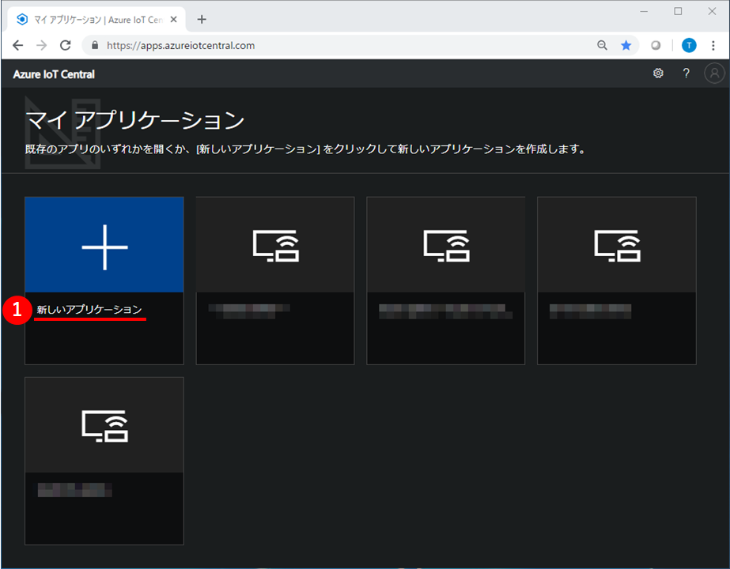

次に、アプリケーションの作成に必要な情報を設定します。  
下表のとおり設定して、`作成`をクリックしてください。

|項目名|値|
|:--|:--|
|支払いプラン|従量課金制|
|アプリケーションテンプレート|カスタムアプリケーション|
|アプリケーション名|==任意==|
|URL|==任意==|
|ディレクトリ|==任意==|
|Azureサブスクリプション|==任意==|
|リージョン|West US|

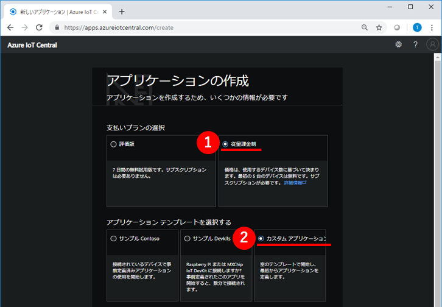  
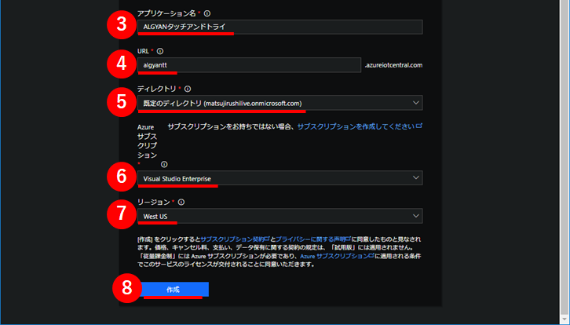

しばらくすると、アプリケーションが作成されて、ダッシュボードが表示されます。  
黄色いポップアップが表示されている場合は、`了解しました`をクリックして、表示を消してください。

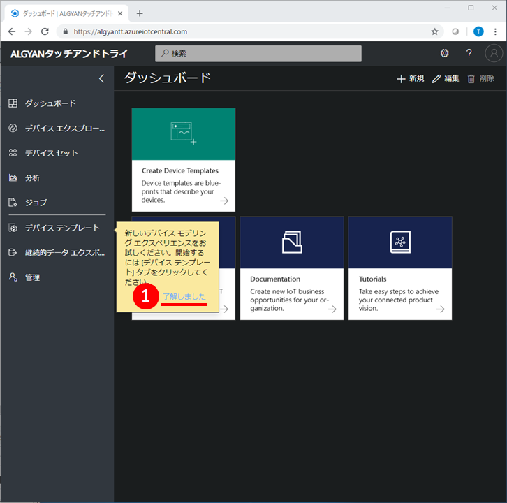

次の画像のとおり表示されていれば成功です。

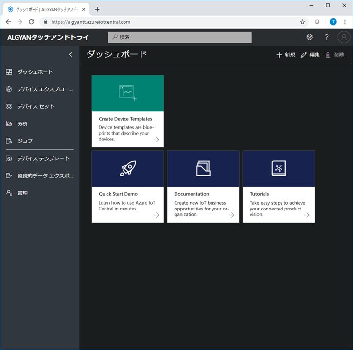

### <a name="1-2">IoTC : デバイステンプレートを作成

> 作成したアプリケーションに、ReButtonのデバイステンプレートを追加します。

左の`デバイステンプレート`をクリックしてください。デバイステンプレートの一覧が表示されます。  
ここで、右上の`+`マークをクリックして、デバイステンプレートを作成してください。

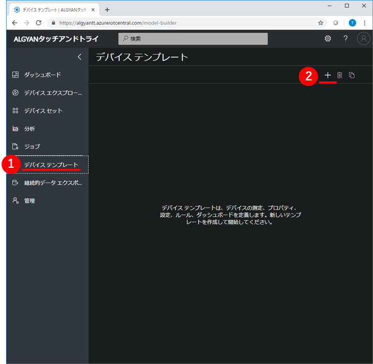

デバイステンプレートの種類は`カスタム`を選択してください。

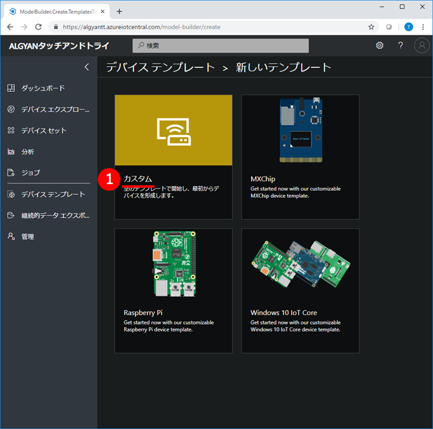

デバイステンプレートの名前に`ReButton`と入力して、`作成`をクリックしてください。

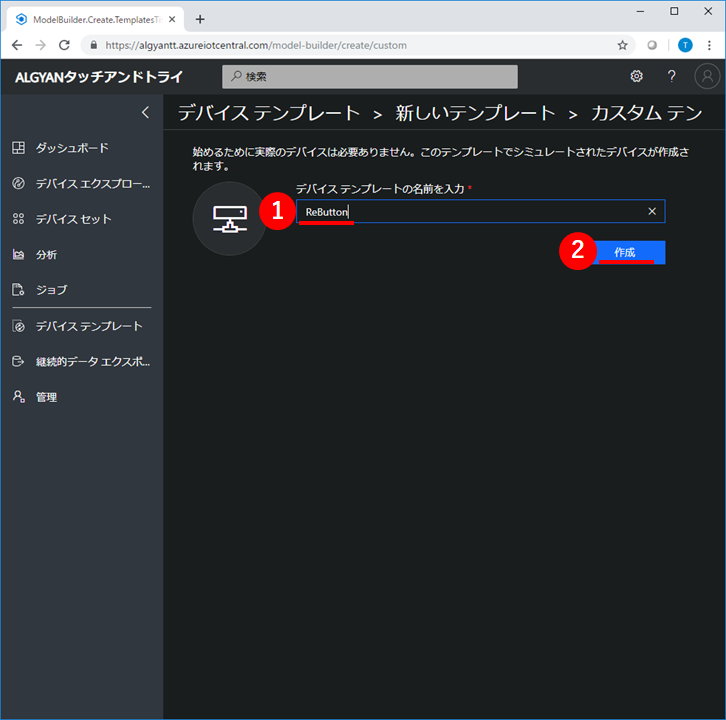

左の`デバイスエクスプローラー`をクリックしてください。  
`ReButton`という名前のデバイステンプレートが表示されて、シミュレート済みデバイスが1つ含まれていれば成功です。

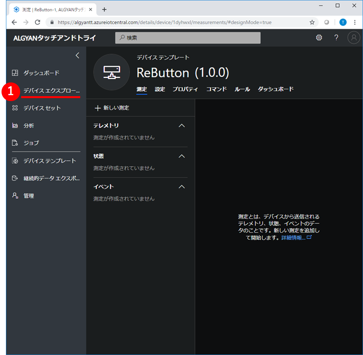  
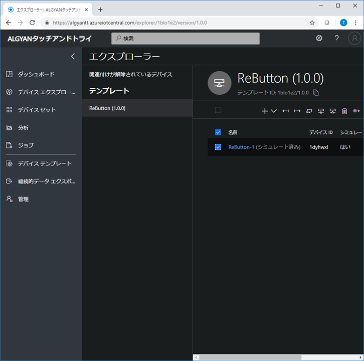

### <a name="1-3">IoTC : 測定にメッセージを追加

> ReButtonのデバイステンプレートに、ReButtonから送られてくる情報を定義します。

左の`デバイステンプレート`をクリックして、`ReButton`デバイステンプレートをクリックしてください。

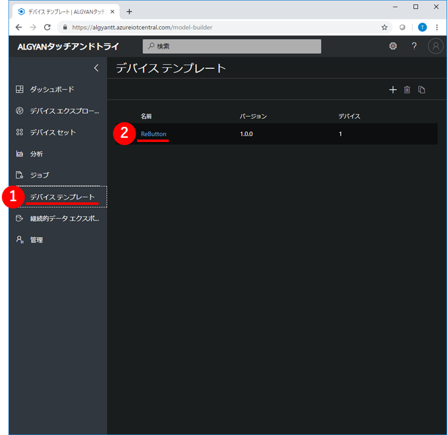

`新しい測定`をクリックしてください。測定の追加画面が表示されます。

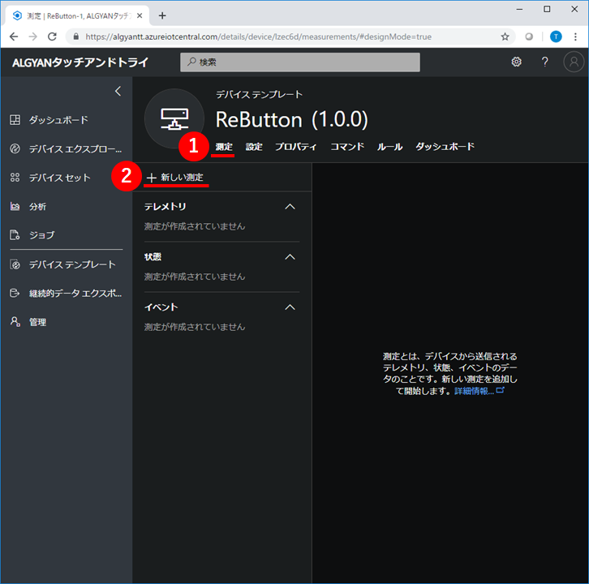

測定の種類が3つ表示されているので、その中から`イベント`をクリックしてください。

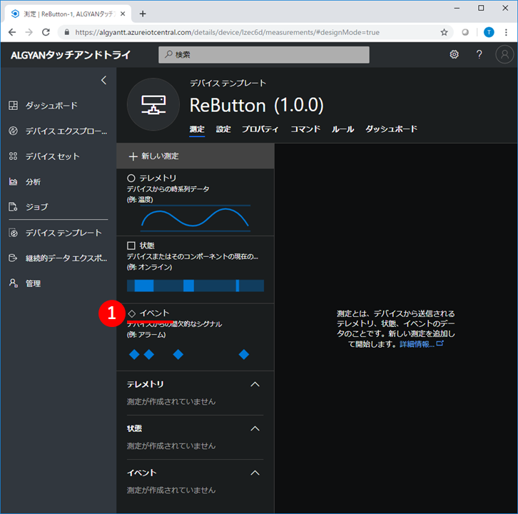

次に、測定の追加に必要な情報を設定します。  
下表のとおり設定して、`保存`をクリックしてください。

|項目名|値|
|:--|:--|
|Display Name|メッセージ|
|フィールド名|message|
|既定の重要度|情報|

次の画像のとおり、イベントに`メッセージ`が表示されていれば成功です。

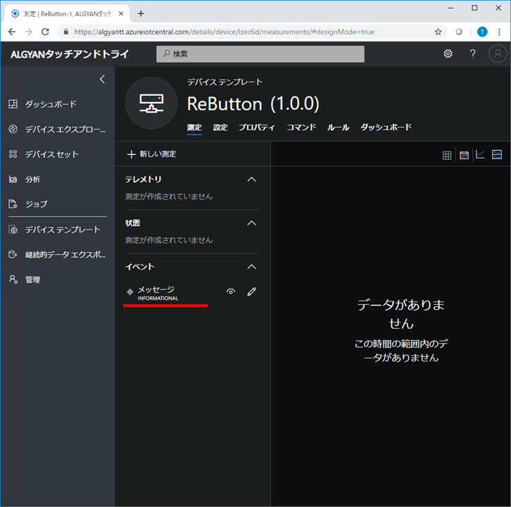

### <a name="1-4">IoTC : デバイスを追加

> ReButtonのデバイステンプレートに、ReButtonデバイスを追加します。

左の`デバイスエクスプローラー`をクリックしてください。`ReButton`デバイステンプレートに含まれているデバイスが一覧表示されます。  
ここで、上にある`+`マークをクリックして、`実際`を選択してください。

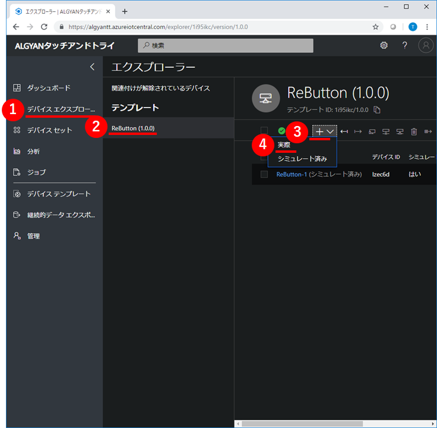

`デバイス名'に==任意==の名前を入力して、`作成`をクリックしてください。

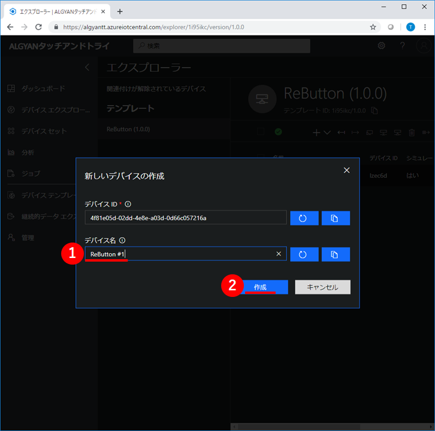

すると、作成したReButtonデバイスが表示されます。  
右上の`接続`をクリックして、このデバイスの接続情報を表示してください。

ここで表示されている`スコープID`,`デバイスID`,`SAS主キー`は、後でReButtonに設定します。  
メモ帳などにコピーしておいてください。

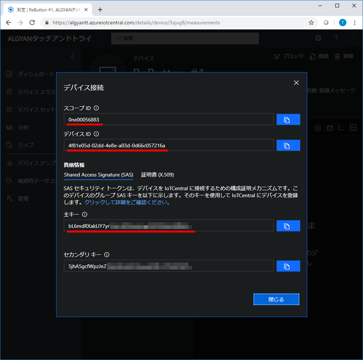

## <a name="2-0">2章 測定項目を増やす

## <a name="3-0">3章 ボタンクリックをSMS通知する

## <a name="F-0">後始末

