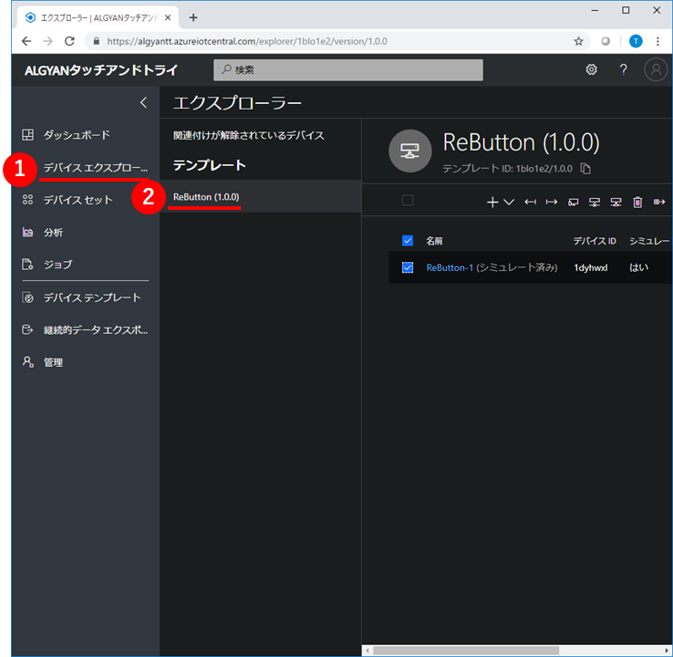
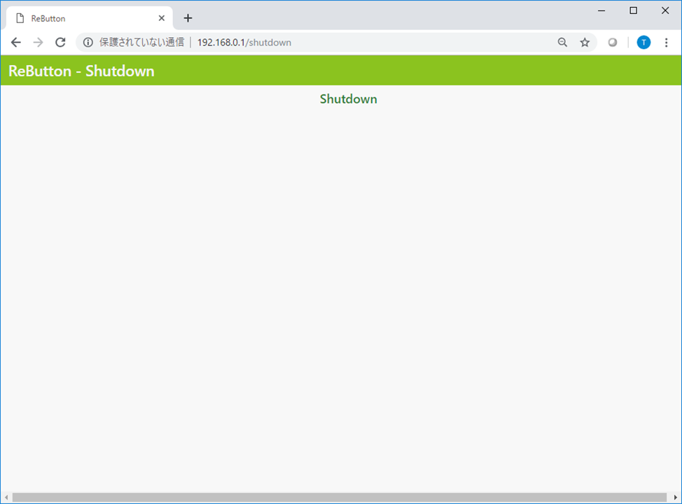
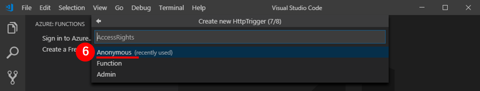
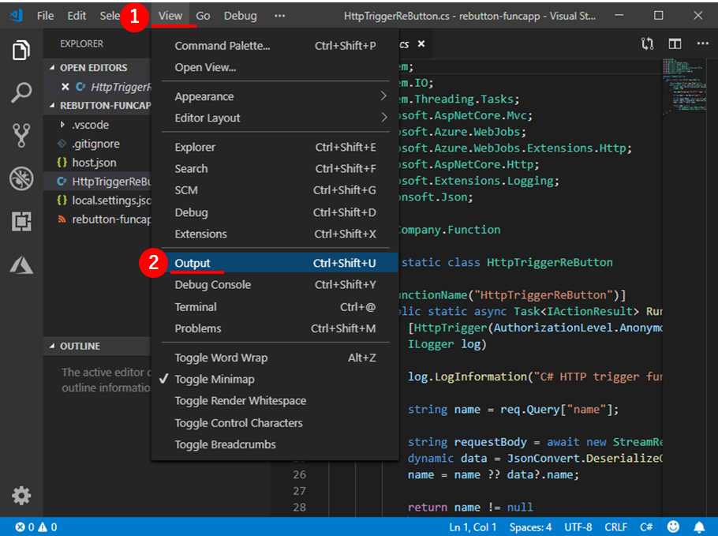
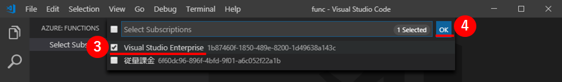
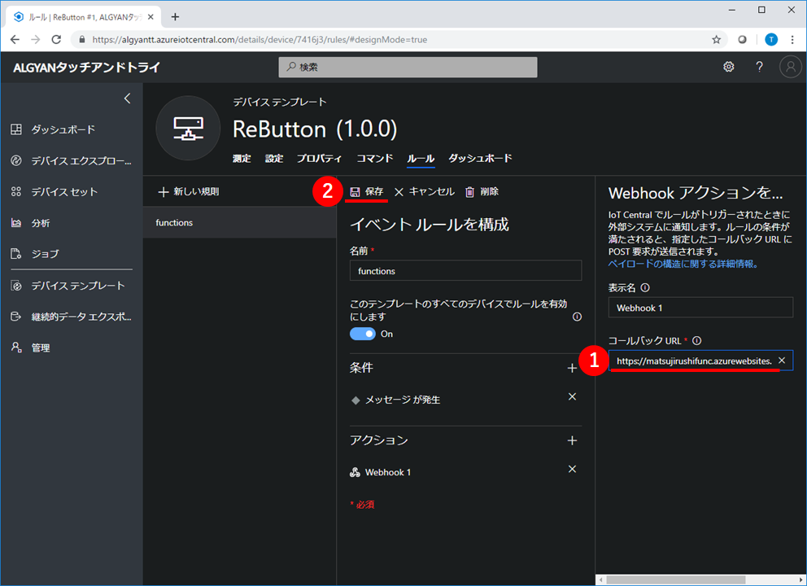

# タッチアンドトライ ~ ReButton ~

## 謝辞

本テキストは、[ReButton+IoT Central体験『 IoT タッチ＆トライ』@de:code2019](https://algyan.connpass.com/event/130744/)のために、IoT ALGYANコミュニティ([Facebook](https://www.facebook.com/groups/ioytjp/), [twitter](https://twitter.com/IOT_ALGYAN?lang=ja), [connpass](https://connpass.com/dashboard/))の有志が協力して制作しています。

スペシャルサンクス！  
* [Takashi Matsuoka](https://github.com/matsujirushi)
* [Yutaka Ohe](https://github.com/y-ohe)
* [Akira Tateishi](https://github.com/greennote)
* [Setouch Zukoudan](https://github.com/zukoudan)
* [tonjiro](https://github.com/tonjiro)
* [Tatsuhiro Oikawa](https://github.com/tatsu1225)

---

目次

- [タッチアンドトライのゴール](#S-0)
- [1章 ボタンクリックをIoT Centralへ伝える](#1-0)
  - [1-1 IoTC :  アプリケーションを作成](#1-1)
  - [1-2 IoTC : デバイステンプレートを作成](#1-2)
  - [1-3 IoTC : 測定にメッセージを追加](#1-3)
  - [1-4 IoTC : デバイスを追加](#1-4)
  - [1-5 ReButton : 工場出荷時設定にリセット](#1-5)
  - [1-6 ReButton : 接続情報を設定](#1-6)
  - [1-7 ReButton : ボタンをクリックしてIoT Centralに通知](#1-7)
- [2章 測定項目を増やす](#2-0)
  - [2-1 IoTC : 測定項目にクリック種類を追加](#2-1)
  - [2-2 IoTC : 測定項目にバッテリー電圧を追加](#2-2)
  - [2-3 ReButton : ボタンをクリックしてIoT Centralに通知](#2-3)
- [3章 ボタンクリックをSMS通知する](#3-0)
  - [3-1 Azure : アクショングループを作成](#3-1)
  - [3-2 IoTC : ルールを追加](#3-2)
  - [3-3 ReButton : ボタンをクリックしてSMS通知](#3-3)
- [4章 ボタンクリックからコード呼び出し](#4-0)
  - [4-1 Azure : Function Appを作成](#4-1)
  - [4-2 VSCode : ローカルにコードを作成](#4-2)
  - [4-3 VSCode : ローカルのコードをFunction Appに配置](#4-3)
  - [4-4 IoTC : ルールを追加](#4-4)
  - [4-5 VSCode : コードのログをモニタリング](#4-5)
- [後始末](#F-0)
  - [F-1 ReButton : 工場出荷時設定にリセット](#F-1)
  - [F-2 IoTC : アプリケーションを削除](#F-2)
  - [F-3 Azure : アクショングループを削除](#F-3)
  - [F-4 Azure : リソースグループを削除](#F-4)

---

## <a name="S-0">タッチアンドトライのゴール</a>

本テキストは、Azureへ簡単にメッセージ送信できるデバイス**Seeed ReButton**と、デバイスを手軽に管理できるクラウドサービス**Azure IoT Central**を使って、IoTシステム構築するタッチアンドトライです。  
デバイス設定、クラウド設定、クラウドサービス連携の手軽さと、プログラミング可能な柔軟性を体感しましょう。


使用するデバイスとサービスは、次の通りです。

|品名|ドキュメント|
|:--|:--|
|[Seeed ReButton](https://www.seeedstudio.com/ReButton-p-2930.html)|[公式(英語)](https://aka.ms/rebutton), [非公式(日本語)](http://matsujirushi.hatenablog.jp/entry/2019/01/23/171257)|
|Azure IoT Central|[公式](https://azure.microsoft.com/ja-jp/services/iot-central/)|
|Azure Monitor|[公式](https://azure.microsoft.com/ja-jp/services/monitor/)|
|Azure Functions|[公式](https://azure.microsoft.com/ja-jp/services/functions/)|

**1章**は、ReButtonのボタンクリック操作をIoT Centralに通知して、Web画面でボタンクリックを知ることができるようにします。  
具体的には、IoT Centralにアプリケーションを作成してデバイステンプレートを作成、デバイスを追加した後、ReButtonにWi-Fi接続情報とIoT Centralへのデバイス接続情報を設定します。

**2章**は、IoT CentralのWeb画面で表示する項目を増やします。  
IoT Centralのデバイステンプレートに、測定項目を追加する簡単な操作だけで、Web画面の表示項目が増えるのを体験します。

**3章**は、ReButtonのボタンクリック操作をIoT Centralを経由してAzure Monitorに通知し、スマートフォンへSMS通知します。  
IoT Centralのルールという機能を使って、Azure Monitorに通知します。Azure Monitorにはさまざまなオペレーターへの通知方法がありますが、SMS通知を使います。

**4章**は、ReButtonのボタンクリック操作をIoT Centralを経由してAzure Functionsに通知します。  
Azure Functionsへ通知することで、その後の動作をプログラミングによって変更できることを学びます。

---

## <a name="1-0">1章 ボタンクリックをIoT Centralへ伝える</a>

### <a name="1-1">1-1 IoTC :  アプリケーションを作成</a>

|この節での実施概要|
|:--|
|Azure IoT Centralのアプリケーションを作成します。|

Webブラウザで`https://apps.azureiotcentral.com`を開いてください。URLを開く際に、Microsoftアカウントでのサインイン認証が求められます。保有しているMicrosoftアカウントを使って、サインインしてください。  
開くと、Azure IoT Centralのアプリケーションが一覧表示されます。  
左上にある、①`新しいアプリケーション`をクリックして、アプリケーションを作成してください。


次に、アプリケーションの作成に必要な情報を設定します。  
下表のとおり設定して、最後に⑧`作成`をクリックしてください。

|項目名|値|
|:--|:--|
|①支払いプラン|従量課金制|
|②アプリケーションテンプレート|カスタムアプリケーション|
|③アプリケーション名|==任意==|
|④URL|==ユニークURL==（同じURLが既に存在するとエラーになります）|
|⑤ディレクトリ|==任意==|
|⑥Azureサブスクリプション|==任意==|
|⑦リージョン|West US|

  


しばらくすると、アプリケーションが作成されて、ダッシュボードが表示されます。  
黄色いポップアップが表示されている場合は、①`了解しました`をクリックして、表示を消してください。


次の画像のとおり表示されていることを確認してください。


---

### <a name="1-2">1-2 IoTC : デバイステンプレートを作成</a>

|この節での実施概要|
|:--|
|作成したアプリケーションに、ReButtonのデバイステンプレートを追加します。|

左の①`デバイステンプレート`をクリックしてください。デバイステンプレートの一覧が表示されます。  
ここで、右上の②[`+`]マークをクリックして、デバイステンプレートを作成してください。この時、「アプリケーションはまだプロビジョニング中」という表示が出た場合には少し待ってから再度試してみてください。


デバイステンプレートの種類は①`カスタム`を選択してください。


デバイステンプレートの名前に①`ReButton`と入力して、②`作成`をクリックしてください。


左の①`デバイスエクスプローラー`をクリックしてください。  
②`ReButton (1.0.0)`という名前のデバイステンプレートが表示されて、`ReButton-1(シミュレート済み)`という名前のデバイスが1つ含まれていることを確認してください。



---

### <a name="1-3">1-3 IoTC : 測定にメッセージを追加</a>

|この節での実施概要|
|:--|
|ReButtonのデバイステンプレートに、ReButtonから送られてくる情報を定義します。|

左の①`デバイステンプレート`をクリックして、②`ReButton`デバイステンプレートをクリックしてください。


デバイステンプレートの①`測定`タブ画面が表示されます。  
②`新しい測定`をクリックしてください。測定の追加画面が表示されます。


測定の種類が3つ表示されているので、その中から①`イベント`をクリックしてください。


次に、測定の追加に必要な情報を設定します。  
下表のとおり設定して、最後に④`保存`をクリックしてください。

|項目名|値|備考|
|:--|:--|:--|
|①Display Name|メッセージ||
|②フィールド名|message|必ず、この値にしてください|
|③既定の重要度|情報||


次の画像のとおり、イベントに**メッセージ**の測定項目が追加されていることを確認してください。


---

### <a name="1-4">1-4 IoTC : デバイスを追加</a>

|この節での実施概要|
|:--|
|ReButtonのデバイステンプレートに、ReButtonデバイスを追加します。|

左の①`デバイスエクスプローラー`をクリックしてください。②`ReButton (1.0.0)`デバイステンプレートに含まれているデバイスが一覧表示されます。  
ここで、上にある③[`+`]マークをクリックして、④`実際`を選択してください。


①`デバイス名`に==任意==の名前を入力して、②`作成`をクリックしてください。


すると、作成したReButtonデバイスが表示されます。  
右上の①`接続`をクリックして、このデバイスの接続情報を表示してください。


ここで表示されている`スコープID`,`デバイスID`,`SAS主キー`は、後でReButtonに設定します。  
**メモ帳などにコピー**しておいてください。


---

### <a name="1-5">1-5 ReButton : 工場出荷時設定にリセット</a>

|この節での実施概要|
|:--|
|ReButtonの設定を工場出荷時の設定にリセットします。|

ReButtonの裏ぶたを取り外してください。  
裏ぶたはシリコン製なのでグンニャリします。隙間にツメを突っ込んで引っ張り上げれば簡単に外れると思います。  
外れたら、電池の横にあるジャンパーピンを写真のように、両方のピンに刺さるようにはめて5秒程度待ちます。正常にピンをはめることができていれば、表側のLEDが赤く点滅するはずです。


その後、またジャンパーピンを写真のように、片方だけ刺さるようにはめ直します。  
これで、ReButtonの工場出荷時設定へのリセットは完了です。


---

### <a name="1-6">1-6 ReButton : 接続情報を設定</a>

|この節での実施概要|
|:--|
|ReButtonを**Access Pointモード**で起動して、パソコンからReButtonに接続、WebページでWi-FiアクセスポイントとAzure IoT Centralの接続情報を設定します。  <br>**ここでのReButtonへの接続情報の設定中は、一旦パソコンのインターネット接続が途切れます。**|

まず、ReButtonをAccess Pointモードで起動します。
このために、10秒以上ボタンを押し続けてください。  
ボタンを数秒間押し続けてでも、LED(青色)が光らない場合は、一度ボタンを押すのをやめて、ひと呼吸、間を開けてから、もう一度ボタンを押し続けてみてください。(ボタンを強く押す必要はありません。少しだけ押し方や押す場所を変えてみると、うまくいくかもしれません。)  

うまくいった場合は、ボタンを押している間、LEDが青色→黄色→水色→白色と変化します。白色になったら、ボタンを離してください。

すると、ボタンがAccess Pointモードで起動して、LEDが白色の点滅になります。


ReButtonがAccess Pointモードで起動したことが確認できたら、次にパソコンからReButtonにWi-Fi接続をします。  
パソコンのWi-Fi接続設定(SSID一覧表示)の中から、「AZB-xxxxxxxx」という名前のアクセスポイントを探してください。  
(「AZB-xxxxxxxx」は、自分が利用するReButtonの側面に貼ってあるSSIDを選択してください。)  
見つけたら、①`接続`をクリックして、Wi-Fi接続します。


接続操作すると、ReButtonのWi-Fi APからは、インターネット接続ができないため、接続試行中のままとなります。
このため、接続試行中表示のまま、次の作業に進みます。  
> Windows 10の場合、ここで待ち過ぎると、元のインターネット接続できるWi-Fi APでの接続に、自動的に戻ってしまうことがあります。続く作業で、うまくいかない場合は、このWi-Fi接続先を再確認してください。

次の作業として、ここでは、ReButtonにWi-FiとAzure IoT Centralの接続設定をするので、任意のブラウザで、①`http://192.168.0.1/` にアクセスしてください。  
ブラウザ画面上に、ReButtonの設定項目一覧画面、ReButton - Homeが表示されますので、②`Wi-Fi`のリンクをクリックしてください。


ReButtonのWi-Fi接続設定画面が表示されます。  
下表のとおり設定して、最後に③`Save`をクリックしてください。

|項目名|値|
|:--|:--|
|①Wi-Fi SSID|`XXXXXXX`をプルダウン候補から選択(当日別途展開します)|
|②Wi-Fi Passphrase|`zzzzzz`(当日別途展開します)|


「Wi-Fi saved.」の表示が出たら、①`Home`をクリックしてください。  


次に、Azure IoT Centralの接続設定を行っていきます。
ブラウザ画面上のReButton - Home画面から、①`Azure IoT Central`のリンクをクリックしてください。


ReButtonのAzure IoT Central接続設定画面が表示されます。  
事前に**メモ帳などにコピー**しておいた各種情報を下表のとおり設定して、最後に④`Save`をクリックしてください。

|項目名|値|
|:--|:--|
|①Scope ID|== 事前にメモしておいた`スコープID` ==|
|②Devise ID|== 事前にメモしておいた`デバイスID` ==|
|③SAS Key|== 事前にメモしておいた`SAS主キー` ==|


最後に、①`Shutdown`をクリックしてください。


Shutdownの表示がされたら、設定完了です。確認ができたら、ブラウザを閉じてください。  
この後は、Azure IoT Central側での操作、動作確認になります。  
パソコンのWi-Fi設定をインターネット接続できるアクセスポイントに切り替えてください。



---

### <a name="1-7">1-7 ReButton : ボタンをクリックしてIoT Centralに通知</a>

|この節での実施概要|
|:--|
|設定済みのReButtonデバイステンプレート上で、ボタンのクリック通知(**メッセージ**)が届くことを確認します。|

Azure IoT Central上で、①`デバイスエクスプローラー`をクリックします。  
その後、テンプレートの②`ReButton (1.0.0)`(自分がつけたデバイステンプレート名)と、続いて③`ReButton #1`(自分がつけたデバイス名)を順にクリックします。


自動的にReButtonの測定画面が表示されます。  
もし、異なる画面が表示された場合、①`測定`をクリックします。


**さあ、ボタンを押してみましょう！**

ReButtonは、最初のクリックの反応が遅いです。  
これは、ボタンを押したときに回路の電源スイッチがONして動き出そうとしている時間です。  
そのため、最初のプッシュはちょっと長めに押し続ける必要があります。  
LEDが青色に点灯するまで押して、青色になったら離す。  
「強く押す」ではありません！ **「長く押す」** です。

|【注意！】| LED(白)になるまで、ボタンを押し続けた場合は、<br>最初の設定で行ったAccess Pointモードになってしまいます。<br>この場合は、一度裏ぶたを開けて、電池を抜き差しして、<br>Access Pointモードを解除し、元に戻してください。 |
|:--|:--|

ボタンの内部プログラムでは、

1. 押す→LEDが青色に  
2. 離す→LEDは青色のまま  
3. 1秒間放置→シングルクリックと判断  
4. クラウドへ通知しようとし、LEDが点滅します。  
> **最後に赤色に点滅**したときは、クラウドへの通知に失敗しています。  
> 何度試しても症状が変わらないときは、IoT Centralの設定、Wi-Fi パスワードの設定などを再度ReButtonに設定してください。

また、3.の1秒間放置のときに押すと、ダブルクリック、トリプルクリックと変化して、LED表示が変わります。

|クリック種類|LED色|
|:--|:--|
|シングルクリック|青|
|ダブルクリック|緑|
|トリプルクリック|紫|

もしくは、ボタンをずっと押し続けていると、下記のように変化します。

|クリック種類|LED色|備考|
|:--|:--|:--|
|ロングプレス|黄||
|スーパーロングプレス|水色||
|ウルトラロングプレス|白|Access Pointモード|


ブラウザでAzure IoT Central上のデバイス**ReButton #1**にイベント通知が届いたか、確認するために、ブラウザの表示を最新に更新します。  
クラウドへのメッセージが届いて、デバイスエクスプローラーの測定画面で確認できるまでには、少し時間がかかります。  
しばらく、根気よく表示の更新を続けてみてください。  
正常にメッセージが届いていると、`♦`マークの表示が出て、確認できます。  
さらに、この`♦`マークにマウスカーソルを合わせ、クリックするとメッセージの詳細が確認できます。


---

## <a name="2-0">2章 測定項目を増やす</a>

### <a name="2-1">2-1 IoTC : 測定項目にクリック種類を追加</a>

|この節での実施概要|
|:--|
|最後のクリック種類ごとの状態値を計測できるようにします。|

①`デバイステンプレート`をクリックし、続いて②`ReButton`のデバイステンプレート名をクリックします。


最初に測定項目を作った時と同じように、デバイステンプレートの①`測定`タブ画面が表示されます。  
②`新しい測定`をクリックしてください。測定の追加画面が表示されます。


測定の種類が3つ表示されているので、その中から①`状態`をクリックしてください。


次に、測定の追加に必要な情報を設定します。  
まず、下表に示す①，②を設定します。

|項目名|値|備考|
|:--|:--|:--|
|①Display Name|クリック種類||
|②フィールド名|actionNum|必ず、この値にしてください|

続いて、③[`+`]をクリックして、状態(クリック種類)ごとの④`値`、⑤`表示名`、⑥`カラー`を下表のように**設定を繰り返し**ながら、状態(クリック種類)を追加していきます。  
> **④`値`は、必ず下表の値を設定してください。**

|状態(クリック種類)|④値|⑤表示名|⑥カラー|参考設定色|RGB|
|:--|:--|:--|:--|:--|:--|
|シングルクリック|**1**|Single Click|==任意の色==|薄水色|rgb(138, 212, 235)|
|ダブルクリック|**2**|Double Click|==任意の色==|薄緑|rgb(1, 184, 170)|
|トリプルクリック|**3**|Triple Click|==任意の色==|マゼンタ|rgb(211, 19, 211)|
|ロングプレス|**10**|Long Press|==任意の色==|ダークイエロー|rgb(242, 200, 15)|
|スーパーロングプレス|**11**|Super Long Press|==任意の色==|水色|rgb(115, 248, 255)|

> ⑥`カラー`の設定は、初期設定値のままでOKです。  
> カラーパレットの割り当て色は、IoT Centralのテーマによって違いがあります。
> (上表の参考設定色やRGB値は、テーマが「ダーク」の場合になります。)  
> 参考設定色のように個別に設定するには、下線の部分をクリックすると色選択のパレットが表示されますので、このパレットの中から選択していきます。  
> また、パレットの各色にマウスカーソルを当てていると、RGB値がpopup表示されます。


全ての状態(クリック種類)の設定が完了したら、①`保存`をクリックしてください。


---

### <a name="2-2">2-2 IoTC : 測定項目にバッテリー電圧を追加</a>

|この節での実施概要|
|:--|
|ReButtonのバッテリー電圧を計測できるようにします。|

前と同じように、①`新しい測定`をクリックしてください。測定の追加画面が表示されます。


今度は、①`テレメトリ`をクリックしてください。


`テレメトリ`の設定に必要な情報は、下表のようになります。

各項目を設定して、最後に⑦`保存`をクリックしてください。

|項目名|値|備考|
|:--|:--|:--|
|①Display Name|バッテリー電圧||
|②フィールド名|batteryVoltage|必ず、この値にしてください|
|③単位|V||
|④最小値|0||
|⑤最大値|4||
|⑥小数点以下桁数|1||
|カラー|==任意の色==|初期値のままでOK|


デバイステンプレートの測定画面でテレメトリと状態のそれぞれに**バッテリー電圧**と**クリック種類**の測定項目が追加されていることを確認してください。


---

### <a name="2-3">2-3 ReButton : ボタンをクリックしてIoT Centralに通知</a>

|この節での実施概要|
|:--|
|設定済みのReButtonデバイステンプレート上で、ボタンのクリック通知(**テレメトリ**、**状態**、**メッセージ**)が届くことを確認します。|

Azure IoT Central上で、①`デバイスエクスプローラー`をクリックします。  
その後、テンプレートの②`ReButton (1.0.0)`(自分がつけたデバイステンプレート名)と、続いて③`ReButton #1`(自分がつけたデバイス名)を順にクリックします。


自動的にReButtonの測定画面が表示されます。  
もし、異なる画面が表示された場合、①`測定`をクリックします。


**さあ、ボタンを押してみましょう！**

イベント通知の確認のときと同じように、ボタンを押します。

|【注意！】| LED(白)になるまで、ボタンを押し続けた場合は、<br>最初の設定で行ったAccess Pointモードになってしまいます。<br>この場合は、一度裏ぶたを開けて、電池を抜き差しして、<br>Access Pointモードを解除し、元に戻してください。|
|:--|:--|

|クリック種類|LED色|
|:--|:--|
|シングルクリック|青|
|ダブルクリック|緑|
|トリプルクリック|紫|

もしくは、ボタンをずっと押し続けていると、下記のように変化します。

|クリック種類|LED色|備考|
|:--|:--|:--|
|ロングプレス|黄||
|スーパーロングプレス|水色||
|ウルトラロングプレス|白|Access Pointモード|

いろいろな押し方で何度か押してみましょう。


ブラウザでAzure IoT Central上のデバイス**ReButton #1**にイベント通知が届いたか、確認するために、ブラウザの表示を最新に更新します。  
クラウドへのメッセージが届いて、デバイスエクスプローラーの測定画面で確認できるまでには、少し時間がかかります。  
しばらく、根気よく表示の更新を続けてみてください。  
正常にメッセージが届いていると、**バッテリー電圧**のグラフ(ポイント)、**状態**の帯表示、♦マークの表示が出て、確認できます。  


---

## <a name="3-0">3章 ボタンクリックをSMS通知する</a>

### <a name="3-1">3-1 Azure : アクショングループを作成</a>

|この節での実施概要|
|:--|
|Azureポータルにサインインして、Azureモニターサービスで、SMSメッセージ通知を行うためのアクショングループを作成します。|

Webブラウザで`https://portal.azure.com`を開いてください。URLを開く際に、Microsoftアカウントでのサインイン認証が求められます。  
**Azure IoT Centralにサインインした時と同じMicrosoftアカウント**を使って、サインインしてください。  
サインインできたら、①`リソース、サービス、ドキュメントの検索`入力にて、「`モニター`」と、キーワード入力し（エンターキーを押す必要はありません）、出てきたサービスの②`モニター`をクリックしてください。


`モニター`サービスの画面が開いたら、①`アラート`をクリックし、続いて②`アクションの管理(Manage actions)`をクリックしてください。


次に、アクションの管理(Manage actions)画面で、①`＋アクショングループの追加`をクリックします。


アクショングループの追加画面で、下表のとおり①～⑥までを設定していきます。

|項目名|値|備考|
|:--|:--|:--|
|①`アクショングループ名`|==任意==||
|②`短い名前`|ReButton|必ずこの名前にしてください|
|③`サブスクリプション`|==任意==||
|④`リソースグループ`|==任意==|初期表示の`Default-ActivityLogAlerts(作成予定)`のままでOKです|
|⑤`アクション名`|==任意==||
|⑥`アクションタイプ`|`電子メール/SMS/プッシュ/音声`|必ずこれを選択してください|

⑥までの設定ができましたら、⑥の右側の`詳細の編集`をクリックしてください。


電子メール/SMS/プッシュ/音声の詳細設定画面で、SMS用の設定を行います。  
まず、①`SMS`にチェックを入れ、国コードで②`81`を選択します。  
続いて、電話番号に、お手持ちのスマートフォン(SMS受信できるデバイスならスマートフォン以外でもOK)の電話番号(先頭'0'なし)を入力してください。

```
ex) 電話番号が「090-xxxx-abcd」の場合、「90-xxxx-abcd」と入力
```
これらの設定が完了したら、最後に④`OK`をクリックし、その後⑤`OK`をクリックします。


アクショングループの追加が完了すると、以下のようになります。  
また、SMSで下記のような通知が届きます。

```
All done. You're in ReButton
group. Reply 'STOP' to stop all.
'Disable ReButton' to stop grp.
'HELP' for info. Msg&data rates
apply
```


---

### <a name="3-2">3-2 IoTC : ルールを追加</a>

|この節での実施概要|
|:--|
|Azure IoT Centralに戻って、作成したAzureモニターサービスに接続するためのルールを追加します。|

Azure IoT Central上で、①`デバイスエクスプローラー`をクリックします。  
その後、テンプレートの②`ReButton (1.0.0)`(自分がつけたデバイステンプレート名)の中にできている③`ReButton-1(シミュレート済み)`にチェックを入れ、これは不要なので、④`ゴミ箱アイコン(削除)`を順にクリックします。


左の①`デバイステンプレート`をクリックして、②`ReButton`デバイステンプレートをクリックしてください。


デバイステンプレートの測定タブ画面から、①`ルール`をクリックして、ルールタブ画面を表示します。  
続いて、②`新しい規則`をクリックし、さらに③`イベント`をクリックしてください。


イベントルールを構成する画面が表示されます。
ここで、下表のとおり設定して、最後に④`保存`をクリックしてください。

|項目名|値|備考|
|:--|:--|:--|
|①名前|==任意==||
|③測定|メッセージ|②[`+`]をクリックして、`条件`を展開した上で、選択します|


次に、アクションの右の①[`+`]をクリックし、右に表示されるアクションの選択の中から②`Azure Monitor アクション グループ`をクリックします。  
```
「②Azure Monitor アクション グループ」は、アクションの選択肢の最後の方にあります。
　上下スクロールさせて、表示させたうえで、クリックしてください。
```


最後に、アクショングループで、先にAzureモニターサービスで作成した①`ReButton`を選択し、②`保存`をクリックして、ルールの追加が終了です。


---

### <a name="3-3">3-3 ReButton : ボタンをクリックしてSMS通知</a>

|この節での実施概要|
|:--|
|Azureモニターサービスに登録したスマートフォンに、ボタンのクリック通知(**メッセージ**)による**SMSメッセージ**が届くことを確認します。|

**さあ、ボタンを押してみましょう！**

イベント通知の確認のときと同じように、ボタンを押します。

|【注意！】| LED(白)になるまで、ボタンを押し続けた場合は、<br>最初の設定で行ったAccess Pointモードになってしまいます。<br>この場合は、一度裏ぶたを開けて、電池を抜き差しして、<br>Access Pointモードを解除し、元に戻してください。|
|:--|:--|

Azure IoT Centralのデバイステンプレートの測定画面でのメッセージ通知の表示と共に、スマートフォンにもメッセージが届きます。  
このとき、デバイステンプレートの測定画面に表示されるタイミングとスマートフォンにメッセージが届くタイミングは、異なります。  
またスマートフォンに届くメッセージは、ReButtonのボタンの押し方が違っても、区別されません。

**このSMS通知は10分以上、時間がかかるときがあります。**


---

## <a name="4-0">4章 ボタンクリックからコード呼び出し</a>

### <a name="4-1">4-1 Azure : Function Appを作成</a>

|この節での実施概要|
|:--|
|Azureポータルにサインインして、Azure Function Appサービスを作成します。|

Webブラウザで`https://portal.azure.com`を開いてください。URLを開く際に、Microsoftアカウントでのサインイン認証が求められます。  
**Azure IoT Centralにサインインした時と同じMicrosoftアカウント**を使って、サインインしてください。  
サインインできたら、①[`+`]をクリックして、②`Marketplaceを検索`に「`function app`」とキーワード入力して、出てきた③`Function App`をクリックしてください。


次にFunction App画面で、①`作成`をクリックします。


続いて、下表のとおり①～④までを設定していきます。

|項目名|値|備考|
|:--|:--|:--|
|①`アプリ名`|==任意==|他に存在しないユニークな名前にしてください|
|②`サブスクリプション`|==任意==||
|③`リソースグループ`|==任意==|`新規作成`を選択し、自動で出る`アプリ名`と同一でOKです|
|④`場所`|米国西部|必ずこれを選択してください|

④までの設定ができましたら、⑤の`作成`をクリックしてください。  
これで、Azure Function Appの作成が完了です。


---

### <a name="4-2">4-2 VSCode : ローカルにコードを作成</a>

|この節での実施概要|
|:--|
|Visual Studio Code(VS Code)を使って、Azure Function AppサービスのWebトリガーを受けるコードを作成します。|

VS Codeを起動し、左端中央の①`Azureマーク`をクリックします。  
続いて、②`フォルダアイコン(Create New Project...)`をクリックします。  
ここで表示されるフォルダ選択ダイアログで、新規プロジェクト用に適当なフォルダを準備し、選択します。

> VS Codeのメニューなど画面表示(表示有無、配置)は、それぞれのパソコンにおける拡張機能(Extensions)のインストール状況で、異なります。  
> 適宜、読み替えてください。


続いて、新規プロジェクトの各項目を下表のとおり①～⑦まで設定していきます。

|項目名|値|備考|
|:--|:--|:--|
|①`Select a language for your function project`|C#||
|②`Select a runtime`|Azure Function v2(.NET Standard)|macOSを使っている場合は表示されません。|
|③`Select a template for your project's first function`|HttpTrigger||
|④`Provide a function name`|==任意==|HttpTriggerReButton|
|⑤`Provide a namespace`|==任意==|Company.Function|
|⑥`AccessRights`|Anonymous||
|⑦`Select how you would like to open your project`|Open in current window||

最後の⑦の設定を選択すると、プロジェクトの作成が始まります。  





プロジェクトの作成が完了すると、C#のプログラムコード(ひな形)がエディタで開かれます。  
ここでも、VS Codeの拡張機能(Extensions)のインストール状況によって、クラスライブラリの依存関係を解決するためのメッセージ(There are unresolved dependencies. Please execute the restore command to continue.)が出る場合があります。  
この場合は、①`Restore`をクリックすることで、解決できます。  
> その他、各種の拡張機能（Extensions)インストールを推奨するメッセージが出たりします。  
> 適宜、メッセージを確認し、処置してください。


最後に、①`View`メニューの中の②`Output`(Ctrl+Shift+U)をクリックして、Outputビューを表示させます。



---

### <a name="4-3">4-3 VSCode : ローカルのコードをFunction Appに配置</a>

|この節での実施概要|
|:--|
|VS Codeで作成したローカルのプロジェクトコードを、Azure Function Appサービスに配置(デプロイ)します。|

①`Sign in to Azure`をクリックして、自分のMicrosoftアカウントを使ってサインインします。  

既に、VS Codeを使ってAzureサービスにサインインしたことがある場合は、VS Code起動時に自動的にサインインが行われてしまっていて、①`Sign in to Azure`が表示されないことがあります。
その場合は、そのまま次のステップに進みます。


②`Select Subscriptions...`をクリックして、有効な自分のAzureサブスクリプション(③`Visual Studio Enterprise`など)を選択し、最後に④`OK`をクリックします。  
正常に自分のAzureサービスに接続(サインイン)できると、作成済みのAzure Function Appのアプリ名一覧が表示されます。




次に、①[`↑`](Deploy to Function App...)をクリックします。


続いて、先に準備しておいた②`(自分のFunction Appアプリ名)`を選択します。  
配置するAzure上のFunction Appを選択すると、既存の配置済みのコードを上書き、元に戻せない旨の確認ダイアログが出ます。  
③`Deploy`をクリックして、ローカルのコードをAzure上に配置(デプロイ)します。


配置(デプロイ)が始まり、正常に終了すると、以下のようになります。


---

### <a name="4-4">4-4 IoTC : ルールを追加</a>

|この節での実施概要|
|:--|
|Azure IoT Centralに戻って、作成したAzure Function Appに接続するためのルールを追加します。|

最初に配置(デプロイ)が終了したFunction Appの①`自分が作成したFunction name`を右クリックし、②`Copy Function Url`をクリックしてURLをコピーしておきます。


3章でやったのと同じように、Azure IoT Central上で、左の①`デバイステンプレート`をクリックして、②`ReButton`デバイステンプレートをクリックしてください。


デバイステンプレートの測定タブ画面から、①`ルール`をクリックして、ルールタブ画面を表示します。  
続いて、②`新しい規則`をクリックし、さらに③`イベント`をクリックしてください。


イベントルールを構成する画面が表示されます。
ここで、下表のとおり設定して、最後に④`保存`をクリックしてください。

|項目名|値|備考|
|:--|:--|:--|
|①名前|functions||
|③測定|メッセージ|②[`+`]をクリックして、`条件`を展開した上で、選択します|


次に、アクションの右の①[`+`]をクリックし、右に表示されるアクションの選択の中から②`Webhook`をクリックします。  


最後に、コールバックURLに、先にAzure Function Appでコピーした①`(自分のFunction URL)`を貼り付けし、②`保存`をクリックして、ルールの追加が終了です。



---

### <a name="4-5">4-5 VSCode : コードのログをモニタリング</a>

|この節での実施概要|
|:--|
|VS Codeを使って、Azure Function Appサンプルの実行を確認します。|

VS Codeにて、最初に配置(デプロイ)が終了したFunction Appの①`自分が作成したFunction name`を右クリックし、②`Start Streaming Logs`をクリックしてストリームログを開始しておきます。


**さあ、ボタンを押してみましょう！**

SMS通知の確認のときと同じように、ボタンを押します。

|【注意！】| LED(白)になるまで、ボタンを押し続けた場合は、<br>最初の設定で行ったAccess Pointモードになってしまいます。<br>この場合は、一度裏ぶたを開けて、電池を抜き差しして、<br>Access Pointモードを解除し、元に戻してください。|
|:--|:--|

VS CodeのOUTPUTビューに、Function App実行時の出力が表示されます。  
このとき、デバイステンプレートの測定画面に表示されるタイミングとスマートフォンにメッセージが届くタイミングは異なります。  
またスマートフォンに届くメッセージは、ReButtonのボタンの押し方が違っても同一です。


---

## <a name="F-0">後始末</a>

### <a name="F-1">F-1 ReButton : 工場出荷時設定にリセット</a>

|この節での実施概要|
|:--|
|今後自分のMicrosoftアカウントに課金されないように、貸出用のReButtonに設定した自分のAzureサービスへの接続情報を、工場出荷時の設定にリセットし、消去します。|

ReButtonの裏ぶたを取り外してください。  
裏ぶたはシリコン製なのでグンニャリします。隙間にツメを突っ込んで引っ張り上げれば簡単に外れると思います。  
外れたら、電池の横にあるジャンパーピンを写真のように、両方のピンに刺さるようにはめて5秒程度待ちます。正常にピンをはめることができていれば、表側のLEDが赤く点滅するはずです。


その後、またジャンパーピンを写真のように、片方だけ刺さるようにはめ直します。  
これで、ReButtonの工場出荷時設定へのリセットは完了です。


---

### <a name="F-2">F-2 IoTC : アプリケーションを削除</a>

|この節での実施概要|
|:--|
|今後自分のMicrosoftアカウントに課金されないように、自分のAzure IoT Centralサービス上に作成したアプリケーションを消去します。|

Azure IoT Centralの画面で、①`管理`をクリックし、②`アプリケーションの設定`、③`削除`を順にクリックします。  
これで、Azure IoT Central側のアプリケーション一式が全て削除できます。


---

### <a name="F-3">F-3 Azure : アクショングループを削除</a>

|この節での実施概要|
|:--|
|今後自分のMicrosoftアカウントに課金されないように、自分のAzureモニターサービスに作成したアクショングループを消去します。|

Azureポータルの画面で、①`モニター`→`アラート`→`アクションの管理`をクリックし、②`ReButton(自分の作成したアクション名)`をクリックします。  


表示されたReButton(自分の作成したアクション名)の画面上部の①`ゴミ箱アイコン(削除)`をクリックします。  
作成したアクションが複数ある場合は、該当する全てのアクションに対して、同じ操作を繰り返し行います。  
これで、Azureサービス側のアクション一式が全て削除できます。


---

### <a name="F-4">F-4 Azure : リソースグループを削除</a>

|この節での実施概要|
|:--|
|今後自分のMicrosoftアカウントに課金されないように、自分のAzureサービスに作成したリソースグループを消去します。|

Azureポータルの画面の左端にある、①`リソースグループ`をクリックし、リソースグループ一覧を表示します。  
この一覧の中から、②`名前(自分の作成したリソースグループ名)`をクリックします。

手順通りに作業していれば、本ハンズオンでは下記のリソースグループが作成されているはずです。

|作成場所|リソースグループ名|
|---|---|
|(IoT Centralが自動生成)|IOTC|
|3章 ボタンクリックをSMS通知する/3-1 Azure : アクショングループを作成|Default-ActivityLogAlerts|
|4章 ボタンクリックからコード呼び出し/4-1 Azure : Function Appを作成|入力したアプリ名から自動生成|


表示されたReButton(自分の作成したアクション名)の画面上部の①`リソースグループの削除`をクリックします。  


リソースグループの削除確認画面が表示されるので、ここで、①`(選択したリソースグループ名)`を手入力して、②`削除`ボタンをクリックします。  
作成したリソースグループが複数ある場合は、該当する全てのリソースグループに対して、同じ操作を繰り返し行います。  
これで、Azureサービス側のリソースグループ一式が全て削除できます。


---
