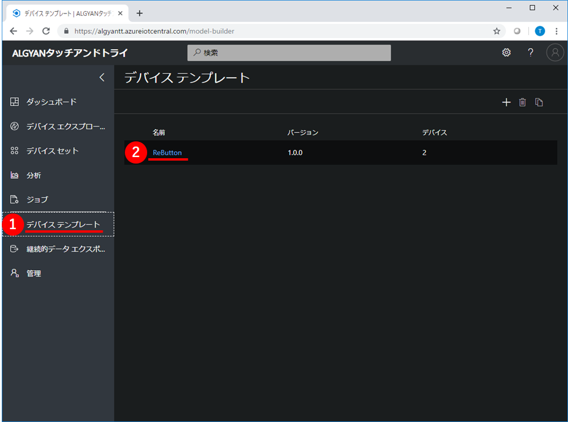
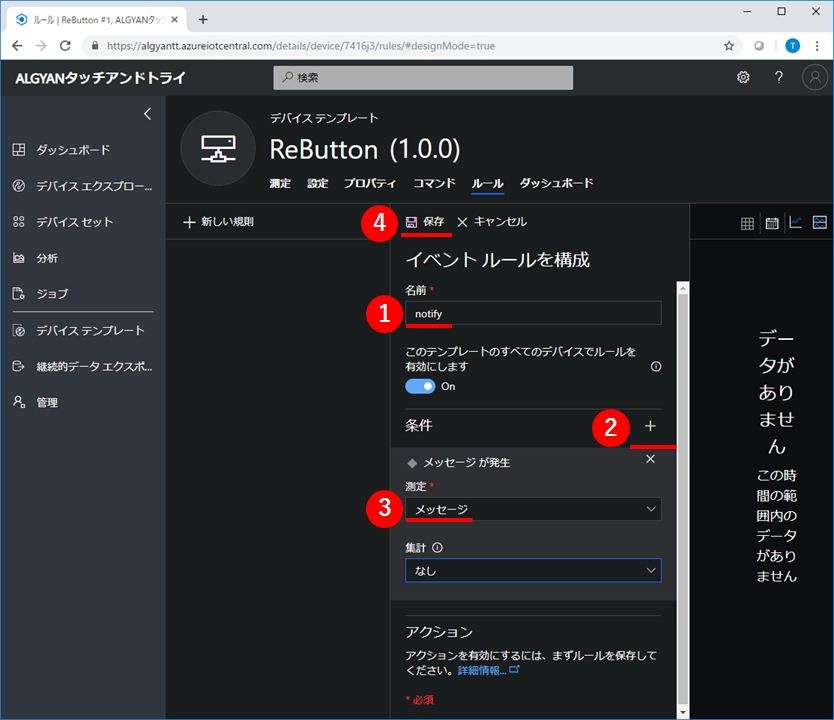

# タッチアンドトライ ~ ReButton ~

---

目次

- [タッチアンドトライのゴール](#S-0)
- [1章 ボタンクリックをIoT Centralへ伝える](#1-0)
  - [IoTC :  アプリケーションを作成](#1-1)
  - [IoTC : デバイステンプレートを作成](#1-2)
  - [IoTC : 測定にメッセージを追加](#1-3)
  - [IoTC : デバイスを追加](#1-4)
  - [ReButton : 工場出荷時設定にリセット](#1-5)
  - [ReButton : 接続情報を設定](#1-6)
  - [ReButton+ : ボタンをクリックしてIoT Centralに通知](#1-7)
- [2章 測定項目を増やす](#2-0)
  - [IoTC : 測定項目にクリック種類を追加](#2-1)
  - [IoTC : 測定項目にバッテリー電圧を追加](#2-2)
  - [ReButton+ : ボタンをクリックしてIoT Centralに通知](#2-3)
- [3章 ボタンクリックをSMS通知する](#3-0)
  - [Azure : アクショングループを作成](#3-1)
  - [IoTC : ルールを追加](#3-2)
  - [ReButton+ : ボタンをクリックしてSMS通知](#3-3)
- [後始末](#F-0)
  - ReButton : 工場出荷時設定にリセット
  - IoTC : アプリケーションを削除
  - Azure : アクショングループを削除

---

## <a name="S-0">タッチアンドトライのゴール</a>

## <a name="1-0">1章 ボタンクリックをIoT Centralへ伝える</a>

### <a name="1-1">IoTC :  アプリケーションを作成</a>

> Azure IoT Centralのアプリケーションを作成します。

Webブラウザで`https://apps.azureiotcentral.com`を開いてください。URLを開く際に、Microsoftアカウントでのログイン認証が求められます。保有しているMicrosoftアカウントを使って、ログインしてください。  
開くと、Azure IoT Centralのアプリケーションが一覧表示されます。  
左上にある、①`新しいアプリケーション`をクリックして、アプリケーションを作成してください。

次に、アプリケーションの作成に必要な情報を設定します。  
下表のとおり設定して、最後に⑧`作成`をクリックしてください。

|項目名|値|
|:--|:--|
|①支払いプラン|従量課金制|
|②アプリケーションテンプレート|カスタムアプリケーション|
|③アプリケーション名|==任意==|
|④URL|==任意==|
|⑤ディレクトリ|==任意==|
|⑥Azureサブスクリプション|==任意==|
|⑦リージョン|West US|

  

しばらくすると、アプリケーションが作成されて、ダッシュボードが表示されます。  
黄色いポップアップが表示されている場合は、①`了解しました`をクリックして、表示を消してください。

次の画像のとおり表示されていれば成功です。

---

### <a name="1-2">IoTC : デバイステンプレートを作成</a>

> 作成したアプリケーションに、ReButtonのデバイステンプレートを追加します。

左の①`デバイステンプレート`をクリックしてください。デバイステンプレートの一覧が表示されます。  
ここで、右上の②[`+`]マークをクリックして、デバイステンプレートを作成してください。

デバイステンプレートの種類は①`カスタム`を選択してください。

デバイステンプレートの名前に①`ReButton`と入力して、②`作成`をクリックしてください。

左の①`デバイスエクスプローラー`をクリックしてください。  
②`ReButton (1.0.0)`という名前のデバイステンプレートが表示されて、`ReButton-1(シミュレート済み)`という名前のデバイスが1つ含まれていれば成功です。

---

### <a name="1-3">IoTC : 測定にメッセージを追加</a>

> ReButtonのデバイステンプレートに、ReButtonから送られてくる情報を定義します。

左の①`デバイステンプレート`をクリックして、②`ReButton`デバイステンプレートをクリックしてください。

デバイステンプレートの①`測定`タブ画面が表示されます。  
②`新しい測定`をクリックしてください。測定の追加画面が表示されます。

測定の種類が3つ表示されているので、その中から①`イベント`をクリックしてください。

次に、測定の追加に必要な情報を設定します。  
下表のとおり設定して、最後に④`保存`をクリックしてください。

|項目名|値|備考|
|:--|:--|:--|
|①Display Name|メッセージ||
|②フィールド名|message|必ず、この値にしてください|
|③既定の重要度|情報||

次の画像のとおり、イベントに`メッセージ`が表示されていれば成功です。

---

### <a name="1-4">IoTC : デバイスを追加</a>

> ReButtonのデバイステンプレートに、ReButtonデバイスを追加します。

左の①`デバイスエクスプローラー`をクリックしてください。②`ReButton (1.0.0)`デバイステンプレートに含まれているデバイスが一覧表示されます。  
ここで、上にある③[`+`]マークをクリックして、④`実際`を選択してください。

①`デバイス名`に==任意==の名前を入力して、②`作成`をクリックしてください。

すると、作成したReButtonデバイスが表示されます。  
右上の①`接続`をクリックして、このデバイスの接続情報を表示してください。

ここで表示されている`スコープID`,`デバイスID`,`SAS主キー`は、後でReButtonに設定します。  
**メモ帳などにコピー**しておいてください。

---

### <a name="1-5">ReButton : 工場出荷時設定にリセット</a>

> ReButtonの設定を工場出荷時の設定にリセットします。

`ReButton`の裏ぶたを取り外してください。  
裏ぶたはシリコン製なのでグンニャリします。隙間にツメを突っ込んで引っ張り上げれば簡単に外れると思います。  
外れたら、電池の横にあるジャンパーピンを写真のように、両方のピンに刺さるようにはめて5秒程度待ちます。

その後、またジャンパーピンを写真のように、片方だけ刺さるようにはめ直します。  
これで、`ReButton`の工場出荷時設定へのリセットは完了です。

---

### <a name="1-6">ReButton : 接続情報を設定</a>

> ReButtonを`Access Pointモード`で起動して、パソコンからReButtonに接続、WebページでWi-FiアクセスポイントとAzure IoT Centralの接続情報を設定します。  
> **ここでのReButtonへの接続情報の設定中は、一旦パソコンのインターネット接続が途切れます。**

まず、ReButtonをAccess Pointモードで起動します。
このために、10秒以上ボタンを押し続けてください。  
ボタンを数秒間押し続けてでも、LED(青色)が光らない場合は、一度ボタンを押すのをやめて、ひと呼吸、間を開けてから、もう一度ボタンを押し続けてみてください。(ボタンを強く押す必要はありません。少しだけ押し方や押す場所を変えてみると、うまくいくかもしれません。)  

うまくいった場合は、ボタンを押している間、LEDが青色→黄色→水色→白色と変化します。白色になったら、ボタンを離してください。

すると、ボタンが`Access Pointモード`で起動して、LEDが白色の点滅になります。

ReButtonが`Access Pointモード`で起動したことが確認できたら、次にパソコンからReButtonにWi-Fi接続をします。  
パソコンのWi-Fi接続設定(SSID一覧表示)の中から、「AZB-xxxxxxxx」という名前のアクセスポイントを探してください。  
(「AZB-xxxxxxxx」は、自分が利用するReButtonの側面に貼ってあるSSIDを選択してください。)  
見つけたら、①`接続`をクリックして、Wi-Fi接続します。

接続操作すると、接続試行中のまま時間がかかりますが、接続試行中表示のまま、次の作業に進みます。  
ここでは、ReButtonにWi-FiとAzure IoT Centralの接続設定をするので、任意のブラウザで、①`http://192.168.0.1/` にアクセスしてください。  
ブラウザ画面上に、ReButtonの設定項目一覧`ReButton - Home`画面が表示されますので、②`Wi-Fi`のリンクをクリックしてください。

ReButtonのWi-Fi接続設定画面が表示されます。  
下表のとおり設定して、最後に③`Save`をクリックしてください。  

|項目名|値|
|:--|:--|
|①Wi-Fi SSID|`XXXXXXX`をプルダウン候補から選択(当日別途展開します)|
|②Wi-Fi Passphrase|`zzzzzz`(当日別途展開します)|

「Wi-Fi saved.」の表示が出たら、①`Home`をクリックしてください。  

次に、Azure IoT Centralの接続設定を行っていきます。
ブラウザ画面上に、ReButtonの設定項目一覧`ReButton - Home`画面から、①`Azure IoT Central`のリンクをクリックしてください。

ReButtonのAzure IoT Central接続設定画面が表示されます。  
事前に**メモ帳などにコピー**しておいた各種情報を下表のとおり設定して、最後に④`Save`をクリックしてください。

|項目名|値|
|:--|:--|
|①Scope ID|== 事前にメモしておいた`スコープID` ==|
|②Devise ID|== 事前にメモしておいた`デバイスID` ==|
|③SAS Key|== 事前にメモしておいた`SAS主キー` ==|

最後に、①`Shutdown`をクリックしてください。

`Shutdown`の表示がされたら、設定完了です。確認ができたら、ブラウザを閉じてください。  
この後は、`Azure IoT Central`側での操作、動作確認になります。  
パソコンのWi-Fi設定をインターネット接続できるアクセスポイントに切り替えてください。

---

### <a name="1-7">ReButton+ : ボタンをクリックしてIoT Centralに通知</a>

> 設定済みのReButtonデバイステンプレート上で、ボタンのクリック通知(`メッセージ`)が届くことを確認します。

`Azure IoT Central`上で、①`デバイスエクスプローラー`をクリックします。  
その後、テンプレートの②`ReButton (1.0.0)`(自分がつけたデバイステンプレート名)と、続いて③`ReButton #1`(自分がつけたデバイス名)を順にクリックします。

自動的に`ReButton`の測定画面が表示されます。  
もし、異なる画面が表示された場合、①`測定`をクリックします。

**さあ、ボタンを押してみましょう！**

`ReButton`は、最初のクリックの反応が遅いです。  
これは、ボタンを押したときに回路の電源スイッチがONして動き出そうとしている時間です。  
そのため、最初のプッシュはちょっと長めに押し続ける必要があります。  
LEDが青色に点灯するまで押して、青色になったら離す。  
「強く押す」ではありません！ **「長く押す」** です。

ボタンの内部プログラムでは、

1. 押す→LEDが青色に  
1. 離す→LEDは青色のまま  
1. 1秒間放置→シングルクリックと判断  
1. クラウドへ通知しようとし、LEDが点滅します。  
(クラウドへの通知に失敗した場合は、最後に赤色に点滅します。**成功するまで、ボタンを押し直してください。**)

また、3.の1秒間放置のときに押すと、ダブルクリック、トリプルクリックと変化して、LED表示が変わります。

|クリック種類|LED色|
|:--|:--|
|シングルクリック|青|
|ダブルクリック|緑|
|トリプルクリック|紫|

もしくは、ボタンをずっと押し続けていると、下記のように変化します。

|クリック種類|LED色|備考|
|:--|:--|:--|
|ロングプレス|黄||
|スーパーロングプレス|水色||
|ウルトラロングプレス|白|`Access Pointモード`|

**【注意！】**  
LED(白)になるまで、ボタンを押し続けた場合は、最初の設定で行った`Access Pointモード`になってしまいます。  
この場合は、一度裏ぶたを開けて、電池を抜き差しして、`Access Pointモード`を解除し、元に戻してください。  
(設定済みのWi-Fi情報やAzure IoT Central接続情報も消えてしまいますでの、再度設定をし直す必要があります。)

ブラウザでAzure IoT Central上のデバイス`ReButton #1`にイベント通知が届いたか、確認するために、ブラウザの表示を最新に更新します。  
クラウドへのメッセージが届いて、`デバイスエクスプローラー`の測定画面で確認できるまでには、少し時間がかかります。  
しばらく、根気よく表示の更新を続けてみてください。  
正常にメッセージが届いていると、`♦`マークの表示が出て、確認できます。  
さらに、この`♦`マークにマウスカーソルを合わせ、クリックするとメッセージの詳細が確認できます。

---

## <a name="2-0">2章 測定項目を増やす</a>

### <a name="2-1">IoTC : 測定項目にクリック種類を追加</a>

> 最後のクリック種類ごとの状態値を計測できるようにします。

①`デバイステンプレート`をクリックし、続いて②`ReButton`のデバイステンプレート名をクリックします。

最初に測定項目を作った時と同じように、デバイステンプレートの①`測定`タブ画面が表示されます。  
②`新しい測定`をクリックしてください。測定の追加画面が表示されます。

測定の種類が3つ表示されているので、その中から①`状態`をクリックしてください。

次に、測定の追加に必要な情報を設定します。  
まず、下表に示す①，②を設定します。

|項目名|値|備考|
|:--|:--|:--|
|①Display Name|クリック種類||
|②フィールド名|actionNum|必ず、この値にしてください|

続いて、③[`+`]をクリックして、状態(クリック種類)ごとの④`値`、⑤`表示名`、⑥`カラー`を下表のように設定しながら、繰り返し値を追加していきます。  
**④`値`は、必ず下表の値を設定してください。**

|状態(クリック種類)|④値|⑤表示名|⑥カラー|参考設定色|RGB|
|:--|:--|:--|:--|:--|:--|
|シングルクリック|**1**|Single Click|== 任意の色 ==|薄水色|rgb(138, 212, 235)|
|ダブルクリック|**2**|Double Click|== 任意の色 ==|薄緑|rgb(1, 184, 170)|
|トリプルクリック|**3**|Triple Click|== 任意の色 ==|マゼンタ|rgb(211, 19, 211)|
|ロングプレス|**10**|Long Press|== 任意の色 ==|ダークイエロー|rgb(242, 200, 15)|
|スーパーロングプレス|**11**|Super Long Press|== 任意の色 ==|水色|rgb(115, 248, 255)|

全ての状態(クリック種類)の設定が完了したら、①`保存`をクリックしてください。

---

### <a name="2-2">IoTC : 測定項目にバッテリー電圧を追加</a>

> ReButtonのバッテリー電圧を計測できるようにします。

前と同じように、①`新しい測定`をクリックしてください。測定の追加画面が表示されます。

今度は、①`テレメトリ`をクリックしてください。

`テレメトリ`の設定に必要な情報は、下表のようになります。

各項目を設定して、最後に⑦`保存`をクリックしてください。

|項目名|値|備考|
|:--|:--|:--|
|①Display Name|バッテリー電圧||
|②フィールド名|batteryVoltage|必ず、この値にしてください|
|③単位|V||
|④最小値|0||
|⑤最大値|4||
|⑥小数点以下桁数|1||
|カラー|== 任意の色 ==|初期値のままでOK|

デバイステンプレートの`測定`画面でテレメトリと状態のそれぞれに`バッテリー電圧`と`クリック種類`の測定項目が追加されていることを確認してください。

---

### <a name="2-3">ReButton+ : ボタンをクリックしてIoT Centralに通知</a>

> 設定済みのReButtonデバイステンプレート上で、ボタンのクリック通知(`テレメトリ`、`状態`、`メッセージ`)が届くことを確認します。

`Azure IoT Central`上で、①`デバイスエクスプローラー`をクリックします。  
その後、テンプレートの②`ReButton (1.0.0)`(自分がつけたデバイステンプレート名)と、続いて③`ReButton #1`(自分がつけたデバイス名)を順にクリックします。

自動的に`ReButton`の測定画面が表示されます。  
もし、異なる画面が表示された場合、①`測定`をクリックします。

**さあ、ボタンを押してみましょう！**

イベント通知の確認のときと同じように、ボタンを押します。

|クリック種類|LED色|
|:--|:--|
|シングルクリック|青|
|ダブルクリック|緑|
|トリプルクリック|紫|

もしくは、ボタンをずっと押し続けていると、下記のように変化します。

|クリック種類|LED色|備考|
|:--|:--|:--|
|ロングプレス|黄||
|スーパーロングプレス|水色||
|ウルトラロングプレス|白|`Access Pointモード`|

いろいろな押し方で何度か押してみましょう。

**【注意！】**  
LED(白)になるまで、ボタンを押し続けた場合は、最初の設定で行った`Access Pointモード`になってしまいます。  
この場合は、一度裏ぶたを開けて、電池を抜き差しして、`Access Pointモード`を解除し、元に戻してください。  
(設定済みのWi-Fi情報やAzure IoT Central接続情報も消えてしまいますでの、再度設定をし直す必要があります。)

ブラウザでAzure IoT Central上のデバイス`ReButton #1`にイベント通知が届いたか、確認するために、ブラウザの表示を最新に更新します。  
クラウドへのメッセージが届いて、`デバイスエクスプローラー`の測定画面で確認できるまでには、少し時間がかかります。  
しばらく、根気よく表示の更新を続けてみてください。  
正常にメッセージが届いていると、`バッテリー電圧`のグラフ(ポイント)、`状態`の帯表示、`♦`マークの表示が出て、確認できます。  

---

## <a name="3-0">3章 ボタンクリックをSMS通知する</a>

### <a name="3-1">Azure : アクショングループを作成</a>

---

### <a name="3-2">IoTC : ルールを追加</a>

---

### <a name="3-3">ReButton+ : ボタンをクリックしてSMS通知</a>

---

## <a name="F-0">後始末</a>

---
