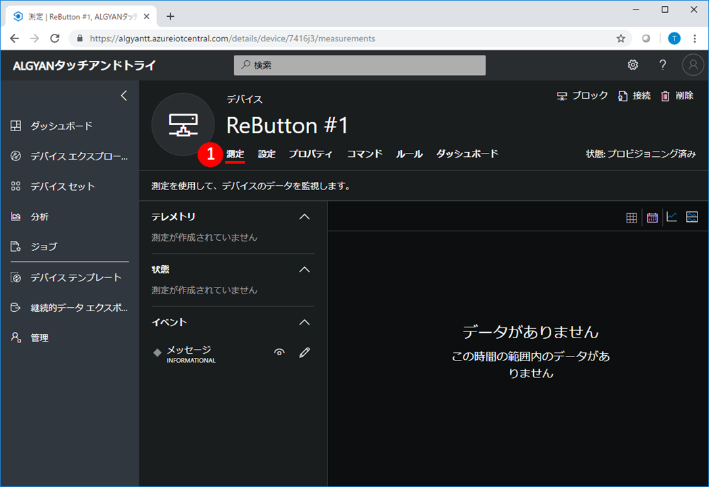
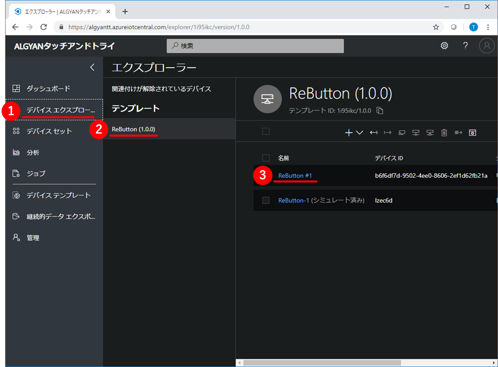

# タッチアンドトライ ~ ReButton ~

---

目次

- [タッチアンドトライのゴール](#S-0)
- [1章 ボタンクリックをIoT Centralへ伝える](#1-0)
  - [IoTC :  アプリケーションを作成](#1-1)
  - [IoTC : デバイステンプレートを作成](#1-2)
  - [IoTC : 測定にメッセージを追加](#1-3)
  - [IoTC : デバイスを追加](#1-4)
  - [ReButton : 工場出荷時設定にリセット](#1-5)
  - [ReButton : 接続情報を設定](#1-6)
  - [ReButton+ : ボタンをクリックしてIoT Centralに通知](#1-7)
- [2章 測定項目を増やす](#2-0)
  - [IoTC : 測定項目にクリック種類を追加](#2-1)
  - [IoTC : 測定項目にバッテリー電圧を追加](#2-2)
  - [ReButton+ : ボタンをクリックしてIoT Centralに通知](#2-3)
- [3章 ボタンクリックをSMS通知する](#3-0)
  - [Azure : アクショングループを作成](#3-1)
  - [IoTC : ルールを追加](#3-2)
  - [ReButton+ : ボタンをクリックしてSMS通知](#3-3)
- [後始末](#F-0)
  - ReButton : 工場出荷時設定にリセット
  - IoTC : アプリケーションを削除
  - Azure : アクショングループを削除

---

## <a name="S-0">タッチアンドトライのゴール

## <a name="1-0">1章 ボタンクリックをIoT Centralへ伝える

### <a name="1-1">IoTC :  アプリケーションを作成

> Azure IoT Centralのアプリケーションを作成します。

Webブラウザで`https://apps.azureiotcentral.com`を開いてください。URLを開く際に、Microsoftアカウントでのログイン認証が求められます。保有しているMicrosoftアカウントを使って、ログインしてください。  
開くと、Azure IoT Centralのアプリケーションが一覧表示されます。  
左上にある、①`新しいアプリケーション`をクリックして、アプリケーションを作成してください。

次に、アプリケーションの作成に必要な情報を設定します。  
下表のとおり設定して、最後に⑧`作成`をクリックしてください。

|項目名|値|
|:--|:--|
|①支払いプラン|従量課金制|
|②アプリケーションテンプレート|カスタムアプリケーション|
|③アプリケーション名|==任意==|
|④URL|==任意==|
|⑤ディレクトリ|==任意==|
|⑥Azureサブスクリプション|==任意==|
|⑦リージョン|West US|

  

しばらくすると、アプリケーションが作成されて、ダッシュボードが表示されます。  
黄色いポップアップが表示されている場合は、①`了解しました`をクリックして、表示を消してください。

次の画像のとおり表示されていれば成功です。

---

### <a name="1-2">IoTC : デバイステンプレートを作成

> 作成したアプリケーションに、ReButtonのデバイステンプレートを追加します。

左の①`デバイステンプレート`をクリックしてください。デバイステンプレートの一覧が表示されます。  
ここで、右上の②[`+`]マークをクリックして、デバイステンプレートを作成してください。

デバイステンプレートの種類は①`カスタム`を選択してください。

デバイステンプレートの名前に①`ReButton`と入力して、②`作成`をクリックしてください。

左の①`デバイスエクスプローラー`をクリックしてください。  
②`ReButton (1.0.0)`という名前のデバイステンプレートが表示されて、`ReButton-1(シミュレート済み)`という名前のデバイスが1つ含まれていれば成功です。

---

### <a name="1-3">IoTC : 測定にメッセージを追加

> ReButtonのデバイステンプレートに、ReButtonから送られてくる情報を定義します。

左の①`デバイステンプレート`をクリックして、②`ReButton`デバイステンプレートをクリックしてください。

デバイステンプレートの①`測定`タブ画面が表示されます。  
②`新しい測定`をクリックしてください。測定の追加画面が表示されます。

測定の種類が3つ表示されているので、その中から①`イベント`をクリックしてください。

次に、測定の追加に必要な情報を設定します。  
下表のとおり設定して、最後に④`保存`をクリックしてください。

|項目名|値|
|:--|:--|
|①Display Name|メッセージ|
|②フィールド名|message|
|③既定の重要度|情報|

次の画像のとおり、イベントに`メッセージ`が表示されていれば成功です。

---

### <a name="1-4">IoTC : デバイスを追加

> ReButtonのデバイステンプレートに、ReButtonデバイスを追加します。

左の①`デバイスエクスプローラー`をクリックしてください。②`ReButton (1.0.0)`デバイステンプレートに含まれているデバイスが一覧表示されます。  
ここで、上にある③[`+`]マークをクリックして、④`実際`を選択してください。

①`デバイス名`に==任意==の名前を入力して、②`作成`をクリックしてください。

すると、作成したReButtonデバイスが表示されます。  
右上の①`接続`をクリックして、このデバイスの接続情報を表示してください。

ここで表示されている`スコープID`,`デバイスID`,`SAS主キー`は、後でReButtonに設定します。  
**メモ帳などにコピー**しておいてください。

---

### <a name="1-5">ReButton : 工場出荷時設定にリセット

> ReButtonの設定を工場出荷時の設定にリセットします。

`ReButton`の裏ぶたを取り外してください。  
裏ぶたはシリコン製なのでグンニャリします。隙間にツメを突っ込んで引っ張り上げれば簡単に外れると思います。  
外れたら、電池の横にあるジャンパーピンを写真のように、両方のピンに刺さるようにはめて5秒程度待ちます。

その後、またジャンパーピンを写真のように、片方だけ刺さるようにはめ直します。  
これで、`ReButton`の工場出荷時設定へのリセットは完了です。

---

### <a name="1-6">ReButton : 接続情報を設定

> ReButtonを`Access Pointモード`で起動して、パソコンからReButtonに接続、WebページでWi-FiアクセスポイントとAzure IoT Centralの接続情報を設定します。

まず、ReButtonをAccess Pointモードで起動します。
このために、10秒以上ボタンを押し続けてください。  
ボタンを数秒間押し続けてでも、LED(青色)が光らない場合は、一度ボタンを押すのをやめて、ひと呼吸、間を開けてから、もう一度ボタンを押し続けてみてください。(ボタンを強く押す必要はありません。少しだけ押し方や押す場所を変えてみると、うまくいくかもしれません。)  

うまくいった場合は、ボタンを押している間、LEDが青色→黄色→水色→白色と変化します。白色になったら、ボタンを離してください。

すると、ボタンが`Access Pointモード`で起動して、LEDが白色の点滅になります。

ReButtonが`Access Pointモード`で起動したことが確認できたら、次にパソコンからReButtonにWi-Fi接続をします。  
パソコンのWi-Fi接続設定(SSID一覧表示)の中から、「AZB-xxxxxxxx」という名前のアクセスポイントを探してください。  
(「AZB-xxxxxxxx」は、自分が利用するReButtonの側面に貼ってあるSSIDを選択してください。)  
見つけたら、①`接続`をクリックして、Wi-Fi接続します。

接続操作すると、接続試行中のまま時間がかかりますが、接続試行中表示のまま、次の作業に進みます。  
ここでは、ReButtonにWi-FiとAzure IoT Centralの接続設定をするので、任意のブラウザで、①`http://192.168.0.1/` にアクセスしてください。  
ブラウザ画面上に、ReButtonの設定項目一覧`ReButton - Home`画面が表示されますので、②`Wi-Fi`のリンクをクリックしてください。

ReButtonのWi-Fi接続設定画面が表示されます。  
下表のとおり設定して、最後に③`Save`をクリックしてください。  
|項目名|値|
|:--|:--|
|①Wi-Fi SSID|`XXXXXXX`をプルダウン候補から選択(当日別途展開します)|
|②Wi-Fi Passphrase|`zzzzzz`(当日別途展開します)|

「Wi-Fi saved.」の表示が出たら、①`Home`をクリックしてください。  

次に、Azure IoT Centralの接続設定を行っていきます。
ブラウザ画面上に、ReButtonの設定項目一覧`ReButton - Home`画面から、①`Azure IoT Central`のリンクをクリックしてください。

ReButtonのAzure IoT Central接続設定画面が表示されます。  
事前に**メモ帳などにコピー**しておいた各種情報を下表のとおり設定して、最後に④`Save`をクリックしてください。

|項目名|値|
|:--|:--|
|①Scope ID|== 事前にメモしておいた`スコープID` ==|
|②Devise ID|== 事前にメモしておいた`デバイスID` ==|
|③SAS Key|== 事前にメモしておいた`SAS主キー` ==|

最後に、①`Shutdown`をクリックしてください。

`Shutdown`の表示がされたら、設定完了です。

---

### <a name="1-7">ReButton+ : ボタンをクリックしてIoT Centralに通知

## <a name="2-0">2章 測定項目を増やす

### <a name="2-1">IoTC : 測定項目にクリック種類を追加

### <a name="2-2">IoTC : 測定項目にバッテリー電圧を追加

### <a name="2-3">ReButton+ : ボタンをクリックしてIoT Centralに通知

## <a name="3-0">3章 ボタンクリックをSMS通知する

### <a name="3-1">Azure : アクショングループを作成

### <a name="3-2">IoTC : ルールを追加

### <a name="3-3">ReButton+ : ボタンをクリックしてSMS通知

## <a name="F-0">後始末
